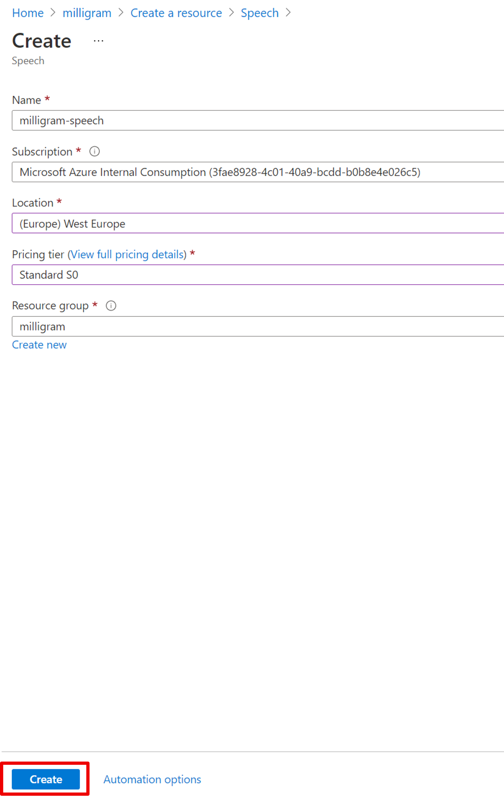

# Challenge 2: Spracherkennung

⏲️ _geschätzte Zeit: 30 min._ ⏲️

## Das wirst du lernen 🎯

In dieser Aufgabe wirst du lernen:

- wie man einen Speech-API-Dienst in Azure erstellt
- wie du deinen Sprach-API-Dienst mit deiner App verbindest
- wie man den API-Schlüssel mit Hilfe von Github Secrets an seine App weitergibt
- wie man mit unserer App spricht 🗣️.

## Inhaltsverzeichnis

### Weitere Ressourcen:

- [Was ist eine Ressource / Ressourcengruppe / Abonnement?](https://docs.microsoft.com/azure/cloud-adoption-framework/govern/resource-consistency/resource-access-management)
- [Speech API](https://azure.microsoft.com/services/cognitive-services/speech-services/#overview)
- [Regionen und Availability Zones in Azure](https://docs.microsoft.com/azure/availability-zones/az-overview)
- [Github Verschlüsselte Geheimnisse](https://docs.github.com/en/actions/reference/encrypted-secrets)

## Erste Schritte

- Navigier zu deiner **Ressourcengruppe**
- Erstelle eine neue **Ressource** und such nach **Speech**
  
  

## Kognitiven Sprachdienst erstellen

  

- Wähle den **Spracheingabe/-ausgabe** Service aus und klick auf **Erstellen**
- Dein Abbonnement und die Ressourcengruppe sollten bereits richtig gesetzt sein. Wähle die Region **West Europa** aus und den **Standard S0**.
- Wähle **Überprüfen + erstellen** und dann **Erstellen**.

  

- Ähnlich wie bei der "Face"-Challenge, kopier diesmal aber nur den Schlüssel, um ihn in **Github Secrets** zu speichern
  

## Speech Service Credential in Github Secret einbinden

- Navigiere in GitHub wieder zu Settings > Secrets > Actions und füge ein `New repository secret` hinzu.
- Name: `VUE_APP_SPEECH_API_KEY`
- Value: Spracherkennungs Schlüssel
- Add Secret

Jetzt werden wir dafür sorgen, dass unsere Milligram Social Media App versteht, wenn wir mit ihr sprechen 🗣️.

## Frontend Pipeline erneut ausführen

- Navigiere nun zu **Actions** > **pages** und **Run workflow** damit deine Änderungen auch angewendet werden.
  
  

  
  

Klick auf den Frontend-Link, der unter dem Deploy-Schritt in deiner Pipeline angezeigt wird `https://<DeinGithubHandle>.github.io/...` oder öffne die App auf deinem Handy noch einmal.

Unsere Frontend-App sollte nun einen neuen Button mit einem Mikrofon-Symbol 🎙️haben, mit dem wir auf deutsch und englisch sprechen können. Was wir hier aufnehmen wird dann transkribiert.

Weder eure Tonaufnahme noch die Transkirbtion werden gespeichert und **nichts** davon taucht in der Timeline oder im News Feed auf.

## Sprich mit mir! Was hast du zu sagen? Spielt herum!

Also leg los und sag mindestens 5 Sätze und erzähl uns, wie toll dich deine App versteht.

Nimm auch ein Buch und lese deiner App vor oder bitte andere Leute, mit deinem Telefon zu sprechen, du wirst überrascht sein. 😁

Standardmäßig werden nur Deutsch und Englisch verstanden, wenn du die Sprache ändern möchtest, kannst du die `Microphone.vue` in Zeile 33 ändern und sie zum Beispiel auf Ukrainisch setzen:
`speechConfig.speechRecognitionLanguage = "uk-UA";`.

Ihr seht, die Sprachen werden mit einem Kürzel gesetzt. Für Deutsch ist das de-DE, für Englisch (USA) ist das en-US und für Ukrainisch uk-UA. [Hier](https://docs.microsoft.com/de-de/azure/cognitive-services/speech-service/language-support) findest du alle anderen Sprachenkürzel.

Das war's für unsere zwei Tage! Glückwunsch! 🥳🙏

## Zu viel? Wir haben die Lösung für dich!

Frag deinen Coach, wenn du nicht fertig geworden bist. Wir haben ein Back-up für dich. ⚠️

### Verwende den vorbereiteten Milligram Backend Service

Sieh dir die vorbereitete App mit unseren Bildern an, damit du herumspielen kannst [Milligram](https://codeunicornmartha.github.io/FemaleAIAppInnovationEcosystem/#/?stack-key=a78e2b9a).

### Was kommt als nächstes?

Starte deine eigene Coding Journey oder probier eine Azure-Zertifizierung aus, so wie wir es mit Udacity, Udemy, Pluralsight, Edx etc. gemacht haben, schau dir die unten stehenden Links an:

_Tipps 📝.

> - [Programmierkurse](https://www.udacity.com/course/intro-to-programming-nanodegree--nd000)
> - Lernpfade

Informier dich auch über unsere Microsoft-Programme:

- MS Aspire Programm
- Praktika bei MS
- Berufliche Laufbahnen bei Microsoft

[◀ vorherige Challenge](../Face/DE_README.md) | [🔼 Home](../../README.md)
