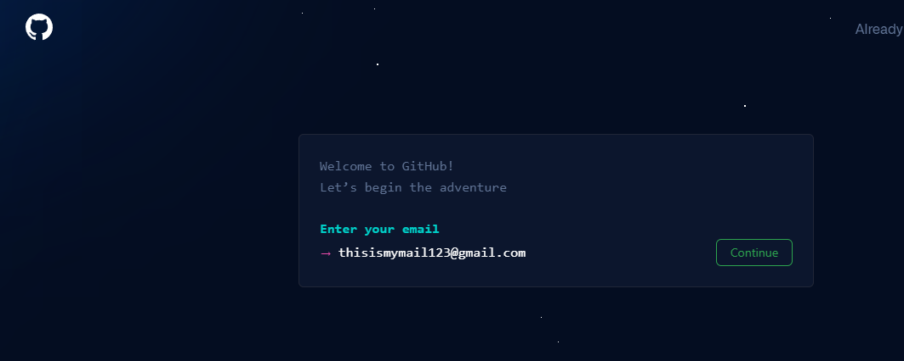
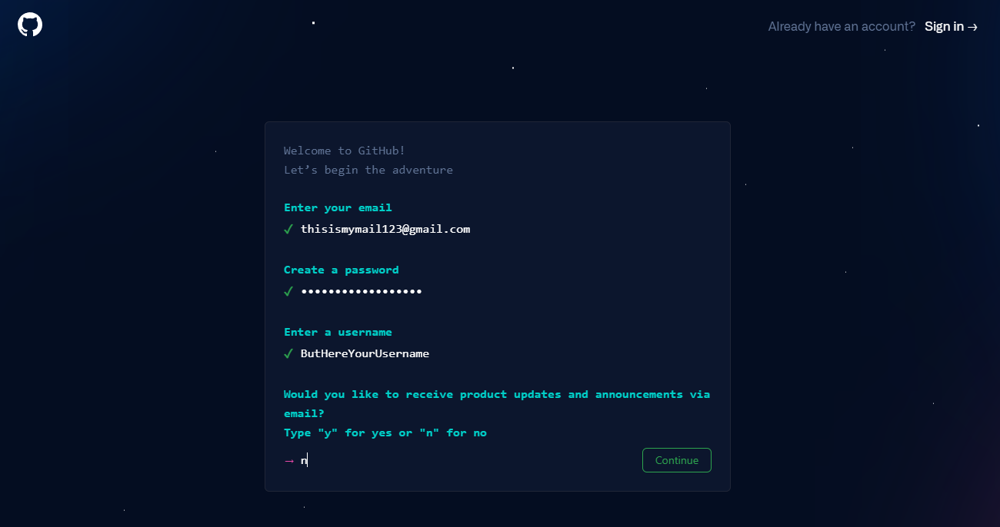
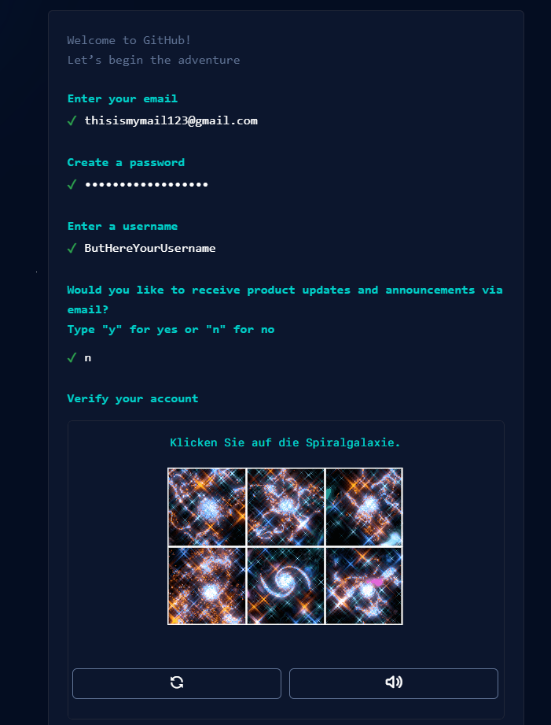
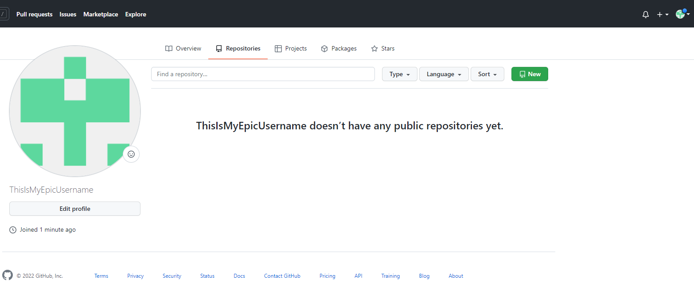
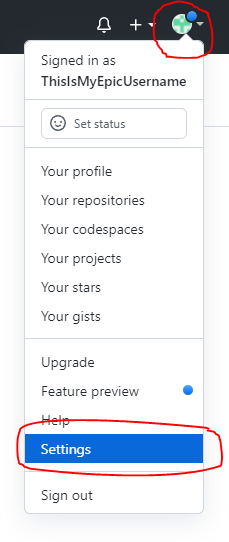
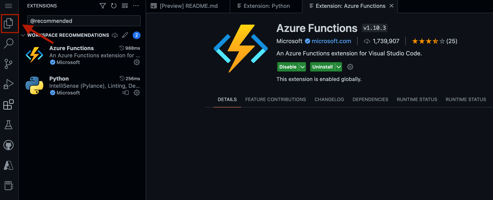

# Challenge 1: GitHub

⏲️ _Est. time to complete: 30 min._ ⏲️

## Here is what you will learn 🎯

In this challenge you will learn how to:

- How to sign up at GitHub and create an account
- How to edit your profile and upload a picture
- How to fork a repository

## Table Of Contents

1. [Sign up and create a GitHub account](#SignUpandCreateatGitHubAccount)
2. [Edit your GitHub profile](#EditGitHubProfile)
3. [Fork repository](#ForkRepository)

## Sign up and create at GitHub account

What is GitHub?

GitHub is actually two things: **Git** and **Hub**.

**Git** is a version control software. It allows developers to work on a specific project at the same time by tracking the changes. If something goes wrong, you can easily undo the changes with Git.
**Hub** is nothing special in itself, but it represents the "social network" of developers built on top of Git. While GitHub does not own the Git software, it has created a platform that makes it easy to access and collaborate with Git. The groundbreaking feature of GitHub is that it makes it super easy to share/show your code with the world or just store it. You no longer have to worry about where you store your code. Companies have GitHub accounts for the same reason. GitHub provides an easy way to store your code online with built-in version control.

- Go to the [GitHub website](https://github.com/) and create a GitHub account.
- Add your email address, password and your desired username
  
  
- Type **y** for receiving emails from GitHub about new product updates and announcements. Or **n** for not receiving emails from GitHub about product updates and announcements.
  

- To **verify** the account, please follow the instructions.
  

You have now successfully created your GitHub account. Now it is time to edit your profile and make it your own.

## Edit your GitHub profile

### Upload a profile picture and insert your name

This is the front page of your account. This overview shows everything about your activities on GitHub, such as your contributions to repositories, your own repositories, your achievements and much more.

To change or add any of your information, click on your icon in the top right corner and choose **Settings**. If you like, you can upload a profile picture here as well.

## Fork Repository

A Fork is a copy of a repository in your own GitHub account. This is extremely handy if you want to freely experiment without making any changes to the original project.

Now, let's go ahead and fork this repository!

## Create your codespace

GitHub Codespaces is a cloud-based development environment that lets you code directly from your browser. It can also be connected to your local Visual Studio Code. 

In your forked repository, click on the green button that says **<> Code**, go to the **Codespaces** tab an click on **Create codespace on main**. Let's do it!

After a few seconds a new browser window will open with your codespace. On the lower right corner you will see a pop-up that asks you if you want to install the recommended extensions for this repository. Click on **Install**.

Another tab in our codespace opens and it installs the extensions for Azure Functions and Python. Click back into the **Explorer** tab on the upper left to see the folder structure of our repository again.

Now that you have successfully created and customised your GitHub account, and created our codespace we will move onto the next challenge for today. 

You will make your first code changes and merge your first pull request here.

[🔼 Home](../../../README.md) | [Next challenge ▶](../ApplicationPart1/README.md)
